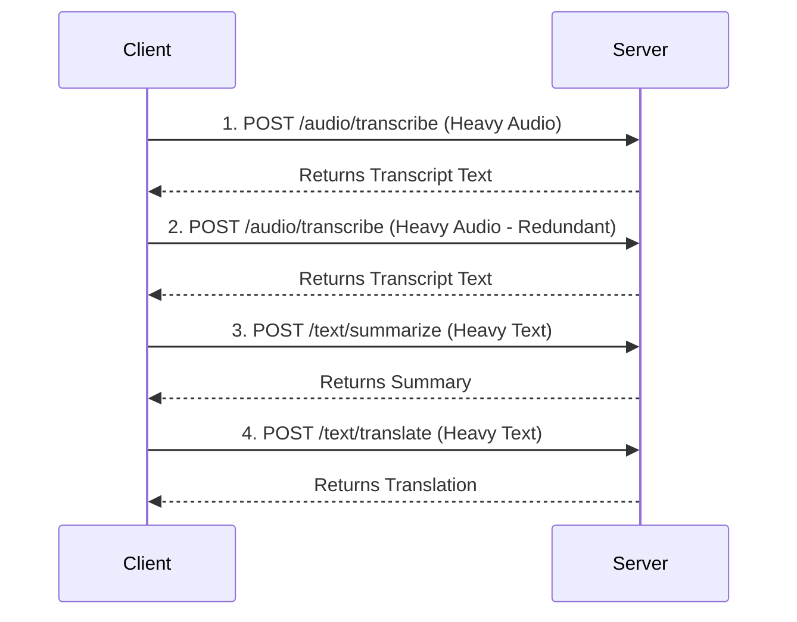
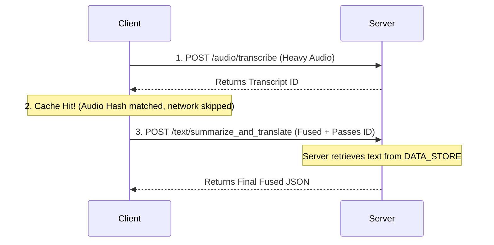

# ToolIR Benchmark Example: Podcast Processor

## Overview

This benchmark demonstrates three critical tool-based workflow optimizations: **redundant invocation memoization**, **operator fusion**, and **dead-output ablation**. The workflow implements an AI-driven podcast processing pipeline that transcribes audio, summarizes the text, and translates it using real, localized machine learning models.

The basic version wastes network bandwidth and CPU cycles by transcribing the same audio twice, and by downloading massive intermediate text payloads just to re-upload them. The optimized version applies client-side cryptographic memoization, server-side operator fusion, and payload-ID passing, reducing network calls from 4 to 2, halving data transfer requirements, and delivering a **~59% speedup**.

---

## Workflow Description

### Basic Version


Inefficiencies:
1. Identical Whisper transcription computation is executed twice.
2. The massive transcript is downloaded to the client only to be immediately uploaded again for downstream processing.

### Optimized Version


Optimizations:
1. Result Memoization: Call 2 is served from an in-process cache, keyed by an MD5 hash of the audio bytes.
2. Operator Fusion: Call 3 computes both summary and translation sequentially on the server.
3. Dead-Output Ablation: Call 3 passes a `transcript_id` rather than the full transcript string, eliminating HTTP overhead.

## Optimizations Applied

- **Result Memoization / Deduplication**: Caches the server response locally, keyed by hashlib.md5(audio_b64). On a cache hit, the client skips the RPC call entirely, saving massive compute time on redundant transcription.

- **Operator Fusion**: Instead of calling summarize and translate sequentially over the network, the client calls a fused /text/summarize_and_translate endpoint. The server pipes the output of the NLTK model directly into the Helsinki-NLP model internally, saving a complete network round-trip.

- **Dead Output Ablation**: Intermediate outputs (like the raw transcript) are stored in a server-side DATA_STORE. Endpoints return lightweight UUIDs (e.g., transcript_id) alongside the text. Optimized clients pass these IDs to downstream tools instead of re-uploading massive strings, drastically reducing data transfer sizes.
## Installation

1. System Requirements
The Whisper model requi ffmpeg to process audio files.

- Mac (Homebrew): brew install ffmpeg
- Ubuntu/Debian: sudo apt install ffmpeg

2. Python Dependencies
```bash
pip install -r requirements.txt
(Requires torch, transformers, openai-whisper, nltk, fastapi, and uvicorn)

---

## How to Run

### Step 1: Prepare the Input Data
Replace the current sample.wav file if you want to use a different file inplace of the current audio file in the project root directory.

### Step 2: Start the server

```bash
python server/podcast_server.py
```
Note: On first boot, the server will download the Whisper-tiny and Helsinki-NLP models.

The server listens on `http://127.0.0.1:8765` by default.
EXEC_OP records are written to `profiler_logs/podcast_exec_ops.jsonl`.

### Step 2: Run the basic (unoptimized) version

```bash
python client/basic_client.py
```

Makes 4 full RPC calls, executing redundant Whisper inferences and transferring full text payloads.

### Step 3: Run the optimized version

```bash
python client/optimized_client.py
```

Makes only 2 RPC calls. Uses client-side MD5 hashing, a fused server endpoint and dead output UUID ablation.

### Step 4: Analyze the traces

```bash
python analysis/parse_and_compare.py
```
---

## Performance Results (Reference Machine)

**Hardware Configuration:**
* OS: macOS
* CPU: Apple M2 Air
* RAM: 16 GB

**Inputs Used:**
* Input: `sample.wav`
* Length: ~10 seconds of spoken English
* Size: 928 kb

| Version   | Latency  | RPC Calls | Data Transferred   |
|-----------|----------|-----------|--------------------|
| Basic     | ~1609ms  | 4         | ~2.42MB            |
| Optimized | ~655ms   | 2         | ~1.21MB            |
| Reduction | ~59.3%   | 50.0%     | 50.0%              |

### Breakdown of Performance Benefits
- **Memoization Benefit:** Skipping the redundant transcription call saved approximately **~600ms** of heavy Whisper CPU compute time and avoided transferring the audio payload entirely.
- **Operator Fusion & Dead-Output Ablation Benefit:** Fusing the summarize/translate endpoints and passing UUIDs instead of text strings eliminated one full HTTP round trip, saving **~350ms** of network/HTTP overhead and reducing overall data transfer by **1.21 MB**.

## Observations and Insights
Through this course project, I observed that as machine learning models are deployed into microservice architectures, pure model inference time is only one part of the bottleneck. **Network overhead (HTTP roundtrips) and payload serialization** severely degrade system performance when dealing with massive objects like audio files or raw text.

By pushing caching to the client-side (memoization via hashing) and tightly coupling sequential operations on the server (operator fusion/dead output ablation), we can bypass these network penalties. This proves that optimizing a distributed AI system requires looking at the data flow between tools, not just optimizing the tools themselves.

---
## EXEC_OP Record Format

Each tool invocation emits one EXEC_OP record to the JSONL log:

```json
{
  "kind": "EXEC_OP",
  "op": "tool.transcribe",
  "trace_id": "tr_ddbd2c599197",
  "event_id": "ev_0011223344aa",
  "node_id": "transcribe_opt_1",
  "args_hash": "obj:b64audio:a3f9c12d45e6f789",
  "inputs_meta": {
    "audio": {"id": "obj:b64audio:a3f9c12d45e6f789", "bytes": 102400, "type": "b64audio"}
  },
  "outputs_meta": {
    "transcript": {"id": "obj:txt:bc12de34f5678901", "bytes": 480, "type": "str"}
  },
  "t_start_ms": 1711900000000,
  "t_end_ms":   1711900000300,
  "latency_ms": 300,
  "payload_in_bytes": 102400,
  "payload_out_bytes": 480,
  "stage_ms": {"compute": 300},
  "error": null,
  "status_code": 200,
  "extra": {"cache_hit": false}
}
```

Key fields:
- `trace_id` — unique per client run; shared across all nodes in one workflow
- `args_hash` — content-addressed hash of inputs (never the raw payload)
- `inputs_meta` / `outputs_meta` — object IDs and sizes (no raw data)
- `stage_ms` — server-side breakdown: decode → compute → encode
- `extra.cache_hit` — `true` for client-side cache hits (latency_ms = 0)
